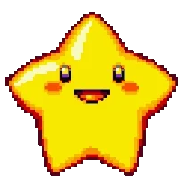
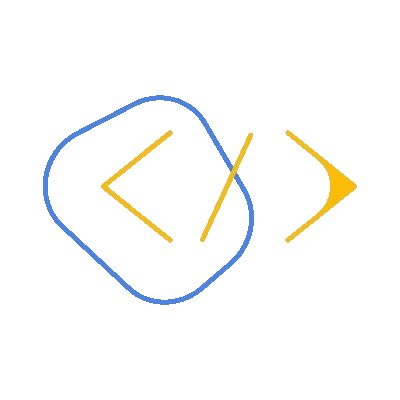

<h1 align="center"><b>Hola, soy Gastón Ramírez </b></h1>

&nbsp;**_*Desarrollador Full Stack — Arquitectura, Rendimiento y Automatización*_**

Apasionado por construir sistemas mantenibles que escalan cuando más lo necesitas. Combino código limpio, arquitectura sólida y optimización de recursos para crear soluciones duraderas.

- 🔍 Debuggeo sistemas distribuidos como puzzles complejos
- 🏗️ Diseño arquitecturas que evolucionan con el negocio
- 🧉 Tomo mate mientras automatizo despliegues con scripts a las 3 AM
- 📝 Documento todo (porque el código lo escriben personas, no máquinas)

## **💡 Lo Que Hago Mejor**

### 💻 Backends de alto desempeño

- APIs que manejan +10K RPM
- Migraciones seguras de legacy
- Arquitecturas limpias, event sourcing y mensajería asíncrona

### ⚡ Optimización de recursos

- Estrategias de caching multinivel
- Tuning de servidores (Linux, Nginx, PHP-FPM)
- Mensajería asíncrona (RabbitMQ)
- Balanceo de carga personalizado

### 🔧 Resolución de problemas

- Diagnóstico de cuellos de botella
- Soluciones pragmáticas para sistemas legacy
- Mejoras de performance comprobables

### 🌐 Puente entre tech y negocio

- Traducción de requerimientos técnicos
- Propuestas de valor real para clientes
- Documentación clara para equipos

## **🚀 Enfoque Actual**

- 🛠 Optimizando sistemas legacy con estrategias de caching estratificado
- 🌐 Diseñando APIs con enfoque en escalabilidad horizontal
- 🛠 Refactorización de monolitos a microservicios
- 🔌 Integración de sistemas IoT
- 🤖 Automatizando procesos manuales con scripts y CI/CD

## **🛠 Habilidades Técnicas**

### Arquitecturas

  
  
  
  
  
  

### Lenguajes de Programación

  
  
  
  
  
  
  
  
  

### Bases de Datos y Caching

  
  
  
  
  

### Infraestructura

  
  
  
  
  
  
  
  
  

### Sistemas y Entornos

  
  
  
  
  

### Frameworks y Librerías

  
  
  
  

## **🌟 Habilidades Blandas**

### 🤝 Relacionales

- Comunicación técnica efectiva
- Trabajo en equipo multidisciplinario
- Gestión y negociación con clientes
- Mentoría y liderazgo técnico

### 🧠 Cognitivas

- Resolución creativa de problemas
- Aprendizaje continuo
- Adaptabilidad tecnológica
- Pensamiento sistémico

## **📫 Contacto**

¿Buscas un desarrollador que construya sistemas pensados para durar?  
📧 gaston.ramirez.developer@gmail.com
